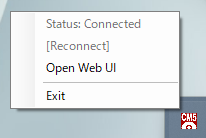
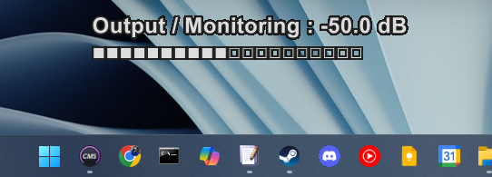

# Unofficial CueMix5 Web API (uo_cm5_webapi)
[Japanese(日本語)](README.md) / English

**Disclaimer for Unofficial Tool:**
This application is not officially supported by MOTU, Inc. Please be fully aware of this before using it.

## Overview

**`Unofficial CueMix5 Web API`** is an unofficial tool that emulates the protocol used by MOTU's official "CueMix 5" application to communicate with devices. It allows you to control MOTU audio interfaces (e.g., Ultralite-mk5) via an HTTP API and a Web UI.
This tool does not support older MOTU devices that do not use CueMix 5.

The Web API server is written in Node.js and is cross-platform (Windows, macOS, Linux).
Additionally, a **Watcher** application is included for Windows users, which provides desktop overlay notifications for status changes like volume adjustments.

**This project was developed with the assistance of the Gemini CLI agent.**

https://github.com/user-attachments/assets/98319dbc-1e5d-4b5b-8961-0d9d7c642e40

## Tested Environment
- OS
  - Windows 11
  - [.NET 8.0](https://dotnet.microsoft.com/en-us/download/dotnet/8.0) (Required for the Watcher to run)
- Device
  - MOTU Ultralite mk5

## Main Features

### Controllable Parameters via Web API
Currently, you can control the following CueMix 5 parameters with `uo_cm5_webapi`.

-   **Input Page**
    -   Input Gain (Channels 1-8)

-   **Output Page**
    -   Monitoring
    -   Phones
    -   Output Trim (Channels 1-10)

-   **Each Mix**
    -   Volume
    -   Mute

## Simulated Mute Function
While MOTU devices' Inputs/Outputs do not have a native mute function, `uo_cm5_webapi` provides a simulated mute function via the API. It works by temporarily setting the volume to its minimum value and remembering the original volume, allowing you to toggle mute ON/OFF.

## Listening Assist Features
These features are designed for users who use both speakers and headphones.

-   **Listening Output Switch**
    -   Switch between Monitoring and Phones outputs with a single click. The currently active output is turned ON, and the other is turned OFF (muted).
-   **Listening Output Master Volume**
    -   Adjust the volume of the currently active listening output (either Monitoring or Phones).

## Web UI

Provides an intuitive interface to control parameters from your browser.


## Web API
All operations correspond to simple HTTP requests, enabling control from external devices like a Stream Deck.
The Web API URLs can be easily generated from the aforementioned Web UI.

## Unofficial CueMix5 Watcher (for Windows)




The Watcher requires [.NET 8.0](https://dotnet.microsoft.com/en-us/download/dotnet/8.0) to run.
This application monitors status changes from the Web API and displays them as an overlay on your desktop.
- Displays information on the lower center of the desktop when volume or mute status changes.
- Stays resident in the system tray, allowing you to open the Web UI or exit the application from the context menu.

## How to Use (For Windows Users)

This section explains the standard installation and usage for Windows users.

### 1. Installation

1. Download the latest `uo_cm5_webapi_vX.X.X.zip` file from the [GitHub Releases page](https://github.com/hogehige2025/Unofficial-CueMix5-Web-API/releases).
2.  Extract (unzip) the downloaded zip file to a location of your choice.

The main files and folders extracted are as follows:

|Filename     				|Description									|
|:--------------------------|:----------------------------------------------|
|uo_cm5_webapi.exe			|The main Web API server application.			|
|EnableStartup.bat			|Batch file to register for automatic startup.	|
|DisableStartup.bat			|Batch file to unregister automatic startup.	|
|SetStartupTask.ps1			|PowerShell script for Task Scheduler operations.|
|uo_cm5_watcher.exe			|The Watcher app for status overlays.			|
|uo_cm5_watcher.cfg			|Configuration file for the Watcher's overlay.	|
|public						|Directory for the Web UI.						|

### 2. First-Time Launch and Auto-Startup Configuration

1. **Right-click** on the `EnableStartup.bat` file in the extracted folder and select **"Run as administrator"**.
2. This script registers the application in the Task Scheduler and starts both the `WebAPI` and the `Watcher`.
3. When the application starts, your default browser should automatically open to the Web UI (`http://localhost:3000`). If it doesn't, please navigate there manually.
4. In the **"Connection Settings"** section of the Web UI, enter the IP address, port, and serial number of your MOTU device and click the "Reconnect MOTU" button. This will save the settings and attempt to connect to your MOTU device.
5. Even if you close the Web UI, the application will continue to run in the background. From now on, the `WebAPI` and `Watcher` will run automatically when you log on to your PC.

### 3. Manual Execution
Double-click `uo_cm5_webapi.exe` to run it. After launching, you can access the Web UI by navigating to `http://localhost:3000` in your browser.

### 4. Generating and Using Web API URLs
When you operate controls like volume in the Web UI, the corresponding URL for that action is displayed in real-time in the `Control URL` section at the bottom of the page.
Click the `Copy Control URL to Clipboard` button to copy the displayed URL.

You can use this URL with `curl`, external launchers like Stream Deck, or register it as a hotkey to control your MOTU device without using the Web UI.

#### Example
- Set the listening volume to -31dB:
    - `curl "http://localhost:3000/set?c=global&o=listening&v=-31"`

### 5. Uninstallation
1. **Right-click** on the `DisableStartup.bat` file in the application folder and select **"Run as administrator"**.
2. This script will stop the running `WebAPI` and `Watcher` processes and remove the auto-startup configuration from the Task Scheduler.
3. Finally, manually delete the application folder and, if necessary, the settings folder located at `%appdata%\uo_cm5_webapi`.

## For Developers or Other Platforms

This section is for developers of this application or for users who want to run only the Web API server on non-Windows operating systems (e.g., macOS, Linux).

### Setup

1.  **Clone or download the repository.**
2.  **Install dependencies.**
    ```bash
    npm install
    ```
3.  **Run in development mode.**
    ```bash
    npm start
    ```

### Build

You can build a standalone executable (`.exe`).

**Prerequisite:** Node.js v20 or higher must be installed.

```bash
npm run build
```

When the command completes, a `dist/` directory will be created in the project root containing the distributable files. A zip archive will be created in the `release/` directory.

## MOTU Device Message Format

Messages sent from this application to a MOTU device are transmitted via WebSocket in a specific hexadecimal string format.
This format is defined in `commands.json` within this application.

### Send Format

A message consists of the following four parts:

| Field   | Byte Length | Description                                   |
| :-------- | :---------- | :-------------------------------------------- |
| **ID**    | 2 bytes     | An ID that identifies the command type.       |
| **Index** | 2 bytes     | An index specifying the target channel, etc.  |
| **Length**| 2 bytes     | The byte length of the subsequent `Value` field.|
| **Value** | Variable    | The actual control value, dependent on the `Length` field. |

### Receive Format

When a WebSocket connection is established, all parameters are sent from the MOTU device.
Additionally, when a parameter is changed via CueMix 5 or a physical knob, only the value for that specific parameter is sent.

The format is the same as the send format, but without the `Length`.

| Field   | Byte Length | Description                                   |
| :-------- | :---------- | :-------------------------------------------- |
| **ID**    | 2 bytes     | An ID that identifies the command type.       |
| **Index** | 2 bytes     | An index specifying the target channel, etc.  |
| **Value** | Variable    | The actual control value.                     |

### Value Encoding

#### Mixer Volume

-   Defined as `type: 'mixvol'` in `commands.json`.
-   **Length**: `4` bytes
-   **Value**: The dB value used in CueMix 5 and the API is converted to a 4-byte hexadecimal value by an internal calculation (`dbToHex`).
    This hex value `0x00000000` corresponds to -∞ dB (when dB is -100 or less), and `0x01000000` corresponds to 0 dB. The maximum value is +12 dB.
    The specific formula is as follows:

    **`HexValue = round(0x01000000 * 10^(dB / 20))`**

    However, if `dB <= -100`, then `HexValue = 0x00000000`.

#### Gain / Trim

-   Defined as `type: 'Gain'` or `type: 'Trim'` in `commands.json`.
-   **Length**: `1` byte
-   **Value**:
    -   **Gain**: The value used in CueMix 5/API is directly encoded as a 1-byte integer. (e.g., `+5db` -> `HexValue = 0x05`)
    -   **Trim**: The **negated** value used in CueMix 5/API is encoded as a 1-byte integer. (e.g., `-8db` -> `HexValue = 0x08`)

#### Mute
-   Defined in conjunction with `type: 'mixvol'` in `commands.json`.
-   Has a separate ID and Index from volume control.
-   **Length**: `1` byte
-   **Value**: `1` (Mute ON) or `0` (Mute OFF) is sent as a 1-byte integer.

#### Examples
- To set `Monitoring` volume to -40db:
    - ID: `0x1393`
    - Index: `0x0000`
    - Length: `0x0001`
    - Value: `0x28`
    - Data Sent: `0x13930000000128`

- To set `Main 1-2 Mix / Line 5` volume to 0db:
    - ID: `0x03f8`
    - Index: `0x0004`
    - Length: `0x0004`
    - Value: `0x01000000`
    - Data Sent: `0x03f80004000401000000`

## HTTP Endpoints

This application provides the following HTTP endpoints:

-   **`GET /`**
    -   Serves the Web UI control page.
-   **`GET /set`**
    -   Sets a command's value using URL parameters. Useful for simple operations from scripts or bookmarks.
    -   **Query Parameters**:
        -   `c`: Category command name (e.g., `main_1_2_mix`)
        -   `o`: Operation command name (e.g., `mic_1`)
        -   `v`: The absolute value to set (e.g., `v=-10`)
        -   `d`: The delta from the current value (e.g., `d=-2` or `d=2`)
        -   `m`: Mute operation (`m=1` for mute, `m=0` for unmute, `m=t` for toggle)

-   **`PATCH /api/commands/{categoryCommand}/{operationCommand}`**
    -   Adjusts the value of a specified command.
    -   **Request Body (JSON)**:
        -   `delta` (number, optional): The delta from the current value. Ex: `{"delta": -2}`
        -   `value` (number, optional): The absolute value to set. Ex: `{"value": -10}`
        -   `mute` (string, optional): Mute operation: `"t"` (toggle), `"0"` (unmute), `"1"` (mute). Ex: `{"mute": "t"}`
        -   `delta` and `value` are mutually exclusive. Can be used with `mute`.

## License

This project is released under the [MIT License](LICENSE).
