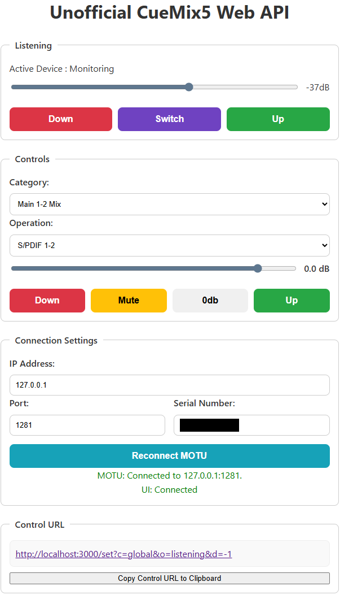

# Unofficial CueMix5 Web API (uo_cm5_webapi)
Japanese(日本語) / [English](README.en.md)

**非公式ツールに関する注意:**
本アプリケーションはMOTU社によって公式にサポートされているものではありません。使用にあたっては、この点を十分にご理解ください。

## 概要

`uo_cm5_webapi`は、MOTU公式アプリケーション「CueMix 5」がデバイスと通信するプロトコルを模倣し、HTTP APIおよびWeb UIを通じてMOTUオーディオインターフェース（例: Ultralite-mk5）を制御するための非公式ツールです。CueMix 5を使用しない古いMOTUデバイスには対応していません。



## 動作確認済み環境
- OS
  - Windows 11
- デバイス
  - MOTU Ultralite mk5

## 主な機能

### 制御可能なパラメーター
現在、`uo_cm5_webapi`でCueMix 5の以下のパラメーターを制御できます。

-   **Inputページ**
    -   Input Gain (1～8チャンネル)

-   **Outputページ**
    -   Monitoring
    -   Phones
    -   Output Trim (1～10チャンネル)

-   **各Mix**
    -   ボリューム
    -   ミュート

## 疑似ミュート機能
MOTUデバイスのInput/Outputには本来ミュート機能がありませんが、`uo_cm5_webapi`ではAPI上で疑似的なミュート機能を提供します。これは、一時的にボリュームを最小値に設定し、元のボリューム値を記憶しておくことで、ミュートのON/OFFをトグルのように動作させるものです。

## リスニング支援機能
スピーカーとヘッドフォンの両方を併用しているユーザー向けの機能です。

-   **リスニング出力の切り替えスイッチ**
    -   MonitoringとPhonesの出力をワンクリックで切り替えます。現在有効な方をON、もう一方をOFF（ミュート）にします。
-   **リスニング出力用マスターボリューム**
    -   有効になっているリスニング出力（MonitoringまたはPhones）のボリュームをまとめて調整できます。

## Web UI
ブラウザから各パラメータを直感的に操作できます。

## Web API
すべての操作はシンプルなHTTPリクエストに対応しているため、Stream Deckのような外部デバイスからの制御ができます。

## 使い方 (For Users)

### 1. インストール

1. [ GitHubのリリースページ](https://github.com/hogehige2025/Unofficial-CueMix5-Web-API/releases)から、最新の`uo_cm5_webapi_vX.X.X.zip`ファイルをダウンロードします。
2.  ダウンロードしたzipファイルを、好きな場所に展開（解凍）します。

展開される主要なファイルとフォルダは以下の通りです。

|Filename     				|Description									|
|:--------------------------|:----------------------------------------------|
|uo_cm5_webapi.exe			|アプリケーション本体							|
|EnableStartup.bat			|自動起動登録バッチ 							|
|DisableStartup.bat			|自動起動登録解除バッチ							|
|SetStartupTask.ps1			|タスクスケジューラ操作用Powershellスクリプト	|
|public						|WebUI用ディレクトリ							|

### 2. 初回起動と自動起動設定

1. 展開したフォルダ内の **`windows/EnableStartup.bat`** ファイルを **右クリックし、「管理者として実行」** を選択します。
2. このスクリプトによりタスクスケジューラにアプリケーションが登録され、`uo_cm5_webapi.exe`が起動します。
3. アプリケーションが起動すると、既定のブラウザが自動的に開き、Web UI（`http://localhost:3000`）が表示されます。万が一開かない場合は、手動でアクセスしてください。
4. Web UIの **「Connection Settings」** セクションで、お使いのMOTUデバイスのIPアドレス、ポート、シリアルナンバーを入力し、「Reconnect MOTU」ボタンをクリックしてください。これにより設定が保存され、MOTUデバイスとの接続が試行されます。
5. Web UIを閉じてもアプリケーションはバックグラウンドで動作し続け、以降はPCログオン時に`uo_cm5_webapi.exe`が自動的に実行されるようになります。

### 3. アプリケーションの手動実行
`uo_cm5_webapi.exe`をダブルクリックして実行します。起動後、ブラウザで`http://localhost:3000`にアクセスするとWeb UIが表示されます。

### 4. Web API URLの生成と利用
Web UI上でボリュームなどを操作すると、画面下部の`Control URL`セクションに、その操作に対応するURLがリアルタイムで表示されます。
`Copy Control URL to Clipboard`ボタンをクリックすると、表示されたURLがクリップボードにコピーされます。

このURLを`curl`コマンドや、Stream Deckなどの外部ランチャー、あるいはショートカットキーに登録することで、Web UIを介さずにMOTUデバイスを制御できます。

#### 例
- リスニング用ボリュームを-31dBに設定
    - `curl "http://localhost:3000/set?c=global&o=listening&v=-31"`

### 5. アンインストール
1. 展開したフォルダ内の **`windows/DisableStartup.bat`** ファイルを **右クリックし、「管理者として実行」** を選択します。
2. このスクリプトにより、実行中の`uo_cm5_webapi.exe`プロセスが停止され、タスクスケジューラから自動起動設定が削除されます。
3. 最後に、アプリケーションのフォルダと、必要に応じて設定ファイルが保存されている `%appdata%\uo_cm5_webapi` フォルダを手動で削除してください。

## 開発者向け (For Developers)

### セットアップ

1.  **リポジトリをクローンまたはダウンロードします。**
2.  **依存関係をインストールします。**
    ```bash
    npm install
    ```
3.  **開発モードで実行します。**
    ```bash
    npm start
    ```

### ビルド

スタンドアロン実行ファイル（`.exe`）をビルドできます。

**前提条件:** Node.js v20以上のバージョンがインストールされている必要があります。

```bash
npm run build
```

コマンドが完了すると、プロジェクトルートに`dist/`ディレクトリが作成され、その中に配布用のファイルが格納されます。zipアーカイブは`release/`ディレクトリに作成されます。

## MOTUデバイス メッセージフォーマット

本アプリケーションからMOTUデバイスへ送信されるメッセージは、特定の16進文字列フォーマットでWebSocket経由で送信されます。
本アプリケーションでは`commands.json`内に定義されています。

### 送信フォーマット

メッセージは以下の4つのパートから構成されます。

| フィールド   | バイト長 | 説明                                           |
| :----------- | :------- | :--------------------------------------------- |
| **ID**       | 2バイト  | コマンドの種類を識別するID。                   |
| **Index**    | 2バイト  | 操作対象のチャンネル等を指定するインデックス。 |
| **Length**   | 2バイト  | 後続の`Value`フィールドのバイト長。            |
| **Value**    | 可変長   | 実際の制御値。`Length`フィールドに依存します。 |

### 受信フォーマット

WebSocket接続時に全てのパラメータがMOTUデバイスから送信されてきます。
また、CueMix5や本体のノブからパラメータが変化した際は該当のパラメータの実が送信されてきます。

メッセージ送信フォーマットと同じですが、Lengthがありません。

| フィールド   | バイト長 | 説明                                           |
| :----------- | :------- | :--------------------------------------------- |
| **ID**       | 2バイト  | コマンドの種類を識別するID。                   |
| **Index**    | 2バイト  | 操作対象のチャンネル等を指定するインデックス。 |
| **Value**    | 可変長   | 実際の制御値。                                 |

### 値のエンコーディング

#### ミキサーボリューム (Mixer Volume)

-   `commands.json`では`type: 'mixvol'` として定義されるパラメータです。
-   **Length**: `4` バイト
-   **Value**: CueMix5やAPIで扱われるdB値が、内部的な計算式（`dbToHex`）によって4バイトの16進数値に変換されます。
    この16進数値は、`0x00000000` で-∞ dB（dB値が-100以下の時）、`0x01000000` で0 dBに相当します。最大値は+12 dBです。
    具体的な計算式は以下の通りです。

    **`HexValue = round(0x01000000 * 10^(dB / 20))`**

    ただし、`dB <= -100` の場合は `HexValue = 0x00000000` となります。

#### ゲインとトリム (Gain / Trim)

-   `commands.json`では`type: 'Gain'` や `type: 'Trim'` として定義されるパラメータです。
-   **Length**: `1` バイト
-   **Value**:
    -   **ゲイン**: CueMix5やAPIで扱われる値が、そのまま1バイトの整数値としてエンコードされます。(`+5db`の場合は`HexValue = 0x05`)
    -   **トリム**: CueMix5やAPIで扱われる値の**符号を反転させたもの**が、1バイトの整数値としてエンコードされます。(`-8db`の場合は`HexValue = 0x08`)

#### ミュート (Mute)
-   `commands.json`では`type: 'mixvol'`とセットで定義されています。
-   ボリューム制御とは別のID、インデックスを持ちます。
-   **Length**: `1` バイト
-   **Value**: `1`（ミュートON）または `0`（ミュートOFF）が1バイトの整数値として送信されます。

#### 例
- `Monitoring`のボリュームを-40dbにする場合
    - ID : `0x1393`
    - Index : `0x0000`
    - Length : `0x0001`
    - value : `0x28`
    - 送信データ : `0x13930000000128`

- 例 `Main 1-2 Mix / Line 5` のボリュームを 0dbにする場合
    - ID : `0x03f8`
    - Index : `0x0004`
    - Length : `0x0004`
    - value : `0x01000000`
    - 送信データ : `0x03f80004000401000000`


## HTTPエンドポイント

本アプリケーションは、以下のHTTPエンドポイントを提供します。

-   **`GET /`**
    -   コントロール用のWeb UIページを提供します。
-   **`GET /set`**
    -   URLパラメータを使用してコマンドの値を設定します。スクリプトやブックマークからの簡易的な操作に利用できます。
    -   **クエリパラメータ**:
        -   `o`: コマンド名 (例: `Monitoring`)
        -   `v`: 設定したい絶対値 (例: `v=-10`)
        -   `d`: 現在値からの差分 (例: `d=-2` or `d=2`)
        -   `m`: ミュート操作 (`m=1`でミュート, `m=0`でアンミュート, `m=t`でトグル)

-   **`PATCH /api/commands/{コマンド名}`**
    -   指定したコマンドの値を調整します。
    -   **リクエストボディ (JSON)**:
        -   `delta` (number, optional): 現在値からの差分。例: `{"delta": -2}`
        -   `value` (number, optional): 設定したい絶対値。例: `{"value": -10}`
        -   `mute` (string, optional): ミュート操作。`"t"` (トグル), `"0"` (ミュート解除), `"1"` (ミュート)。例: `{"mute": "t"}`
        -   `delta` と `value` は排他的です。`mute` と同時に使用できます。

## ライセンス

このプロジェクトは[MITライセンス](LICENSE)の下で公開されています。